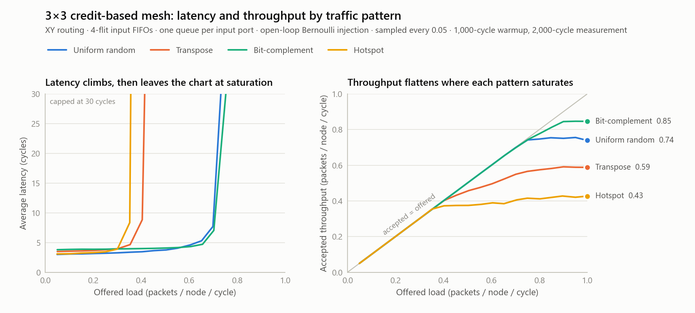

# M4 -- Real Verification

Wires M3's credit-based router into a mesh (the piece M3's README flagged
as not yet done), then does three things with it:

1. **Verifies it under sustained load.** Four synthetic traffic patterns,
   a scoreboard that can't be fooled by tag wraparound, and invariant
   checks embedded in the RTL that continuously verify credit
   conservation and arbiter fairness under real traffic -- not just in
   hand-picked directed scenarios.
2. **Measures it.** A latency vs. offered-load sweep across all four
   patterns finds where each one saturates, and a pencil-and-paper model
   of the mesh predicts where each one *should* saturate. Three of the
   four land exactly on their prediction; the fourth doesn't, and that
   gap is the reason M5 exists.
3. **Verifies the verification.** A mutation test injects known bugs
   into the RTL and requires the testbenches to catch every one.

See [NoC Router 101](../README.md) for the underlying concepts (packets,
XY routing, credits) if you haven't read the earlier milestones -- this
document only covers what's new.

## What's new

- **`rtl/mesh_credit.sv`** -- M2's mesh-wiring pattern applied to M3's
  credit-based router instead of M1/M2's valid/ready router. Same genvar-
  only wiring discipline, `credit_return` replacing `ready` throughout.
  Unlike M2's mesh, this one has *real* per-hop latency (confirmed by the
  smoke test below: a 4-hop corner-to-corner packet takes exactly 4
  cycles, 1 per hop) rather than M2's same-cycle combinational delivery --
  which is the whole reason this milestone needed it before any
  latency/throughput measurement could mean anything.
- **`tb/mesh_credit_tb.sv`** -- M2's directed multi-hop scenarios, re-run
  through the credit-based mesh.
- **`tb/random_traffic_tb.sv`** -- every tile injects packets at a fixed
  rate for thousands of cycles, across four classic synthetic traffic
  patterns (see below), while a scoreboard verifies every packet arrives
  exactly once, unreordered relative to every other packet from the same
  source, with unchanged data.
- **`tb/latency_sweep_tb.sv`** -- one latency/throughput measurement at a
  given pattern and offered load, using the standard open-loop method
  (below). Every run is also a full correctness run: misrouting, loss,
  duplication, reordering, RTL invariants, and a drain-after-load
  deadlock check.
- **Invariant checks embedded in the RTL** (`flit_fifo.sv`, `router.sv`):
  FIFO occupancy never exceeds capacity, credit counters never exceed
  `BUFFER_DEPTH`, and no input with a ready-to-go flit ever waits more
  than `NUM_PORTS` cycles for arbitration (round-robin's fairness
  guarantee, checked, not just asserted in a comment). See "A note on
  assertions" below for why these are immediate assertions plus a
  procedural bound rather than SVA `property`/`assert property`.
- **`tools/`**:
  - `sweep.sh` runs the whole sweep.
  - `theory_check.py` checks the sweep against the analytic model.
  - `plot_sweep.py` draws the charts.
  - `mutation_test.sh` verifies the verification.

## Running it

```sh
./run.sh                       # regression: smoke test, 4 scoreboard runs, 1 sweep point
tools/sweep.sh                 # full sweep: 4 patterns x 20 loads, 16 sims in parallel (~45 s)
python tools/theory_check.py   # analytic model vs. the sweep (stdlib only)
python tools/plot_sweep.py     # redraws results/latency_sweep*.png (needs matplotlib)
tools/mutation_test.sh         # injects known bugs; every one must be caught (~40 s)
DEPTH=8 PATTERNS=0 tools/sweep.sh   # the "is it just the buffers?" experiment below
```

Every testbench dumps a VCD when run directly. The one exception is
deliberate: `tools/sweep.sh` passes `+NODUMP`, because a full-mesh VCD is
~19 MB per run and 80 parallel runs would write gigabytes to one colliding
filename. To get the waveform for any sweep point, run that point by hand:
`vvp sim/latency_sweep_tb.vvp +PATTERN=0 +RATE=750`.

## Traffic patterns

Four synthetic patterns, standard in NoC evaluation (see e.g. Dally &
Towles, *Principles and Practices of Interconnection Networks*):

| Pattern | Destination rule | What it stresses |
|---|---|---|
| Uniform random | Any tile but yourself, equally likely | Average-case behavior |
| Transpose | `(x,y) -> (y,x)` | A permutation that concentrates load on specific diagonal paths |
| Bit-complement | Mirror through the mesh center | Long-distance, adversarial-by-construction paths |
| Hotspot | 25% of traffic converges on tile 0, else uniform | Many-to-one convergence, like a shared memory controller |

Tiles with no partner under a permutation (the diagonal under transpose,
the center under bit-complement) send uniform random traffic instead.

## Latency and throughput

### How it's measured

The scoreboard runs above prove the mesh is *correct* under load. They
can't say *how much* load it sustains, because they simply stop offering
traffic when a tile has no credit, so an overloaded network looks the
same as a healthy one. `latency_sweep_tb.sv` uses the standard open-loop
method instead (Dally & Towles, ch. 23):

```
  every cycle, each tile flips a                 packet leaves the queue
  biased coin: new packet w.p. rate              only when the tile has credit
            |                                              |
            v                                              v
   generate --> [ unbounded source queue ] --> inject --> [ mesh ] --> deliver
      ^                                          ^                        ^
      |<------------- total latency (reported) ------------------------->|
                                                 |<--- network latency -->|
```

- **Offered load** is set by the coin, whatever the network can take. If
  the network can't keep up, the source queues grow without bound and
  total latency blows up. That blow-up is the signal being measured.
- **Phases.**
  1. Warmup (1,000 cycles): reach steady state, measure nothing.
  2. Measure (2,000 cycles): packets generated here are tagged.
  3. Drain: keep the background load running until every tagged packet
     arrives.
  4. Flush: stop all traffic. The network must empty completely. Any
     packet still inside is lost or deadlocked, and fails the run.
- **Accepted throughput** is packets delivered per tile per cycle during
  the measurement window. Below saturation it equals offered load. Past
  saturation it flattens out.
- **Saturation (the knee)** is the highest offered load whose average
  latency stays within 3x the zero-load latency. Loads are swept in steps
  of 0.05, so each knee is really a bracket: the network saturates
  somewhere between that point and the next one.

### Results

<picture>
  <source media="(prefers-color-scheme: dark)" srcset="results/latency_sweep_dark.png">
  
</picture>

The same data as the plot, with the analytic model beside it (full data:
[`results/latency_sweep.csv`](results/latency_sweep.csv); reproduce the
model with `tools/theory_check.py`):

| Pattern | Zero-load latency, model / measured | Saturation bound (model) | What sets the bound | Measured saturation |
|---|---|---|---|---|
| Uniform random | 3.00 / 3.01 cycles | 1.00 | Each tile's injection/ejection port (the busiest channel carries only 0.75 lambda) | 0.70-0.75 |
| Transpose | 3.44 / 3.49 cycles | 0.44 | Corner channels (0,0)->(0,1) and (2,2)->(2,1) carry 2.25 lambda | 0.40-0.45 |
| Bit-complement | 3.83 / 3.80 cycles | 0.73 | The center router's East and West outputs carry 1.375 lambda | 0.70-0.75 |
| Hotspot | 3.06 / 3.09 cycles | 0.36 | Tile (0,0)'s ejection port receives 2.75 lambda | 0.35-0.40 |

"lambda" is each tile's injection rate. The model routes every
source-destination pair with XY routing, adds up how much traffic lands
on each channel and each ejection port, and takes the bound as
1 / (the heaviest load), since nothing can carry more than one flit per
cycle.

### Reading the results

**Zero-load latency matches the model to within 0.05 cycles for every
pattern.** Latency at light load is 1 cycle to enter the source router
plus 1 cycle per hop, with cut-through at every router. Uniform random
averages exactly 2.0 hops on a 3x3 mesh, so it takes 3.0 cycles. (The
smoke test's "4 cycles for 4 hops" starts its clock one edge later, once
the flit is already inside the source router.)

**Three of the four patterns saturate exactly where the wiring says they
must.** For transpose, bit-complement, and hotspot, the model's bound
falls inside the measured saturation bracket. For those patterns the
router isn't the bottleneck; the topology is.

- **Transpose.** XY routing funnels (1,0)->(0,1) and (2,0)->(0,2)
  through the same corner, and tile (0,0)'s own traffic joins them. No
  router design can fix that. Only a different routing algorithm could.
- **Hotspot.** The mesh is bounded by tile (0,0)'s single ejection port.
  That's the NoC version of every core hammering one memory controller.

**Uniform random is the exception.** Nothing in the topology stops it
before 1.0, yet it saturates at 0.70-0.75. At 0.75 offered load the
busiest channel in the mesh is only 56% utilized. The mesh has link
bandwidth to spare, and the router is failing to use it.

**Past saturation, the backlog moves to the edge of the network.**
Uniform random at 1.0 offered load:

- Network latency (injection to delivery) plateaus at about 10 cycles,
  because the mesh is full but still moving.
- Total latency reaches 714 cycles, because the excess is queued at the
  sources.

Aggregate accepted throughput can sit above a pattern's bound past
saturation, because the bound only throttles the flows that use the
bottleneck. Under hotspot, the 8 non-hotspot tiles are held to 0.364
each. Tile (0,0) never sends to itself, so it keeps injecting. Accepted
throughput plateaus at 0.428, against a model value of
(8 x 0.364 + 1) / 9 = 0.434.

### Is it just the buffers?

The obvious first suspect for uniform's missing throughput is buffer
depth. Four flits per input might be too few to cover the credit round
trip. To test it, the sweep was re-run with every input FIFO doubled to 8
flits (`DEPTH=8 PATTERNS=0 tools/sweep.sh`,
[`results/latency_sweep_depth8.csv`](results/latency_sweep_depth8.csv)):

| Input FIFO depth | Average latency at 0.75 offered | Accepted at 0.80 offered | Peak accepted throughput |
|---|---|---|---|
| 4 flits | 43.2 cycles | 0.747 | 0.756 |
| 8 flits (2x the buffer storage) | 9.5 cycles | 0.793 | 0.811 |

Twice the storage buys 7% more peak throughput. It pushes the knee out
slightly and leaves most of the gap to 1.0 in place. Buffer capacity
isn't the main limit. **Head-of-line (HOL) blocking** is:

```
  West input FIFO at router (1,1)              output ports this cycle
  +---------+---------+---------+---------+
  | head    |         |         |         |     East:  granted to another input
  | -> East | -> North| -> South| -> Local|     North: idle
  +---------+---------+---------+---------+     South: idle
       ^                                        Local: idle
       blocked: East is busy
       ...and every flit behind it waits too, though 3 of their outputs are free
```

With one FIFO per input port, an input can only ever request the output
its head flit needs. When that output is busy, the whole input stalls. A
deeper FIFO holds more waiting flits but doesn't let any of them jump the
line. That's why doubling depth barely helps.

The standard fix is **virtual channels**: split each input's buffer into
several independent queues that share the physical link, so a blocked
head flit stops blocking everything behind it. That's the core of M5, and
this sweep is how it gets judged. The first question is whether 2 virtual
channels x 4 flits (the same 8 flits of storage as the depth-8 row above)
beat 1 queue x 8 flits.

([M5's answer](../m5_virtual_networks/README.md#measured-vcs-alone-are-not-enough):
barely, at 0.820 vs 0.811, until the switch allocator gets a second
pass. Then 2 VCs x 4 reach 0.872, and 4 VCs x 2 reach 0.905. The VCs
were giving the router choices that a one-pass allocator couldn't use.)

## Verifying the verification: mutation testing

A checker that has never fired might simply be unable to fire.
`tools/mutation_test.sh` copies the RTL, injects one realistic bug at a
time, and runs both randomized testbenches against each copy. Every
mutant must make at least one testbench fail. As a control, the unmutated
RTL goes through the exact same harness first and must pass. Otherwise a
broken harness would "catch" everything.

The three mutants are chosen so that each one needs a *different* checker
to catch it:

| Mutant | Bug injected | Caught by | Why the other checks miss it |
|---|---|---|---|
| `credit_overflow` | Credit counters reset to `BUFFER_DEPTH + 1`, so every sender believes there's one more buffer slot than exists | Credit-bound invariant, on the first cycle after reset (both testbenches) | Nothing overflows until a buffer actually fills. At light load every packet still arrives, so the scoreboard sees nothing wrong. |
| `fixed_priority` | The round-robin pointer never advances: arbitration is fixed-priority | Bounded-wait (starvation) invariant (both testbenches) | Every packet is still delivered intact, just unfairly. No data check can see unfairness. |
| `route_east_west` | Packets that need to go East are routed West | Scoreboard and drain check: packets pile up against the mesh edge and never arrive | The invariants: a flit waiting on an output with no credit isn't eligible for arbitration, so no fairness bound is broken. Only the missing packets show the bug. |

All three are caught. Taken together they show the value of checks at
different levels: data checks catch *wrong answers*, and embedded
invariants catch *wrong behavior* that hasn't produced a wrong answer
yet.

## A real bug, found and fixed -- worth reading if you're skeptical of "it just worked"

Hotspot traffic initially produced scoreboard failures that looked exactly
like a router data-integrity bug: packets appearing to arrive out of
order, or not at all. Chasing it down took several real steps, each of
which ruled something out before the actual cause was found:

1. **First suspect: the scoreboard itself.** The original scoreboard
   tagged each packet with a 4-bit sequence number embedded in its
   payload. That tag can only represent 16 values. It turned out one
   specific packet really could sit queued behind others for 50+ cycles
   under hotspot congestion while 16 *other* packets from the same source
   got sent and delivered around it. That wrapped the tag back onto a
   still-outstanding packet and produced a real, but false, mismatch.
   Fixed by tracking which specific tag values are actually in use (not
   just how many are outstanding) and never reallocating one that's still
   pending.
2. **With that fixed, the same failure persisted.** It was now provably
   not a tag collision, since collisions were impossible by construction.
   That ruled out the scoreboard and pointed at something real: one
   packet, sent on a single hop between two adjacent tiles, simply never
   arrived.
3. **Hierarchical waveform-style tracing** found the actual mechanism.
   That meant watching the sending router's own input FIFO and credit
   state cycle by cycle, via direct signal references into the DUT. The
   testbench's own sender-side credit counter believed it had room to
   send when the real FIFO was already full. The push was silently
   dropped, which is exactly what the credit protocol is supposed to make
   impossible from the *sender's* side.
4. **Root cause:** the testbench tracked that counter with two separate
   always-blocks. One decremented on send (called from a procedural
   task). The other incremented on a credit-return pulse (a separate
   `always @(posedge clk)`). This test injects from every tile every
   cycle, denser than any earlier milestone's testbench. Under that load,
   a send and a same-cycle credit return could both need to update the
   same counter in the same cycle, and the two-process version
   occasionally lost one of the two updates. The result was a permanent,
   silent leak of exactly one credit, indistinguishable from a real
   hardware bug until traced back to its source.
5. **Fix:** collapse both updates into one synchronous process with a
   single case statement covering "sent", "returned", "both", and
   "neither" together. That exactly mirrors `router.sv`'s own
   `credit_count` update, which was already correct for the same reason.
   Rewriting the testbench, not the router, made every pattern pass clean
   across 8,000+ packets each with zero mismatches.

The RTL was correct the entire time. The lesson worth keeping: a
testbench that tracks protocol state (credits, in this case) needs the
*same* care against races that the RTL itself does. "It's just a test"
doesn't exempt it from the exact class of bug the design is being tested
for.

## What's verified

`tb/mesh_credit_tb.sv` passes 12/12 checks:

- The same multi-hop routing and contention coverage as M2, now through
  a router with real buffering and real per-hop latency.
- A final check that none of the RTL's embedded invariants fired.

`tb/random_traffic_tb.sv`, run once per pattern (all passing):

| Pattern | Packets injected | Mismatches |
|---|---|---|
| Uniform random | ~8,089 | 0 |
| Transpose | ~8,090 | 0 |
| Bit-complement | ~8,084 | 0 |
| Hotspot | ~8,052 | 0 |

`tb/latency_sweep_tb.sv` ran all 80 sweep points (4 patterns x 20 loads)
as full correctness runs:

- Zero errors and zero invariant violations.
- The network drained completely after every one.
- That includes hotspot at 1.0 offered load, 2.75x past its saturation
  bound.
- XY routing is deadlock-free by construction. This is the empirical
  confirmation that the implementation kept that property under every
  load tested.

Every run of every testbench carries router.sv's embedded invariant
checks (FIFO bounds, credit bounds, bounded-wait fairness), active the
whole time. So these properties held not just in the hand-picked directed
scenarios from M1-M3, but under sustained, adversarial-by-design traffic
for thousands of consecutive cycles. The mutation test shows these checks
can actually fire.

## A note on assertions (and why they aren't `property`/`assert property`)

This Icarus build (12.0-devel) does not support SystemVerilog concurrent
assertions at all. That was confirmed directly: a minimal
`property`/`assert property` file fails to even parse. Plain unlabeled
immediate assertions (`assert (expr) else ...;` inside a procedural
block) do work. Given that, "SVA assertions: deadlock/livelock freedom,
credit conservation" from the project's plan is implemented here as:

- **Credit conservation** -- an immediate assertion directly on
  `credit_count`, checked every cycle, in every router instance in the
  mesh.
- **Livelock/starvation freedom** -- a procedural bounded-wait counter per
  input port (not a temporal `property`, since that syntax isn't
  available). It fails an immediate assertion if any ready-to-go request
  ever waits longer than round-robin's own fairness guarantee allows.

Both live directly in `router.sv`/`flit_fifo.sv`, guarded as
verification-only (not synthesizable, and not meant to be). Every
testbench that exercises the design gets this checking automatically,
without needing a separate assertion-only test. Each violation also
increments `noc_pkg::assertion_violations`, and every testbench fails
its run if that counter is nonzero. A fired assertion can't scroll past
unnoticed in an otherwise-passing log.

## Not yet covered

- **HOL blocking** -- measured and explained above, deliberately left
  unfixed here; [M5](../m5_virtual_networks/README.md) fixes it.
- Mesh sizes other than 3x3 (mechanical to add, not yet swept).
- Multi-flit packets. Every packet here is a single flit, so wormhole
  behavior (a packet's flits strung across several routers) isn't
  exercised.
- A rigorous, temporal deadlock-freedom proof. The drain-after-load check
  above is empirical, and the bounded-wait check covers
  livelock/starvation specifically, a narrower and more tractable
  property than general deadlock freedom.
