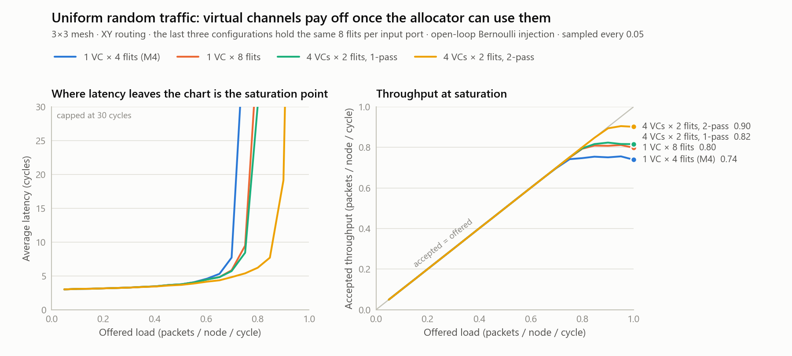

# M5 -- Virtual Channels and Virtual Networks

M4 ended with two problems, one measured and one hidden:

1. **Measured:** uniform random traffic saturated at ~0.72 packets/node/cycle,
   when the mesh's wiring allows 1.0. M4 traced the gap to head-of-line
   (HOL) blocking inside the router.
2. **Hidden:** every flit in M1-M4 was the same kind of message. A real
   coherent fabric carries a *protocol*: requests, snoops, and responses
   that depend on each other. Letting them share buffers can deadlock the
   whole chip, and nothing in M1-M4 could have shown it.

M5 rebuilds the router around **virtual channels** (the fix for #1) and
**virtual networks** (the fix for #2). It reproduces both problems on
purpose, and measures both fixes.

See [NoC Router 101](../README.md) for the basics (packets, XY routing,
credits) and [M4's README](../m4_verification/README.md) for the
measurement method. This document covers what's new.

## Results at a glance

- **+12% saturation throughput at equal storage, +20% over M4.** On uniform
  random traffic:
  - M4's router (one 4-flit FIFO per input port) accepts at most 0.756.
  - Spending 8 flits per port on one deeper FIFO reaches 0.811.
  - Spending the same 8 flits on 4 virtual channels, with a 2-pass switch
    allocator, reaches **0.905**.
  - VCs alone don't do it (0.824), and neither does the second pass alone.
    It takes both.
- **Protocol deadlock, reproduced and eliminated.**
  - With all message classes sharing buffers, coherence-style traffic
    deadlocks in 5 of 8 runs at 8 outstanding transactions per tile, and
    8 of 8 at 16 or more.
  - Tripling the buffers only moves the cliff to 32.
  - The same buffers split into one virtual network per message class:
    **0 deadlocks in 48 runs**, up to 64 outstanding.
- **Bit-exact equivalence with M4.** Configured as 1 VN x 1 VC, the new
  router reproduces all 80 of M4's sweep points digit for digit.
- **Verification.**
  - 17 directed tests.
  - 544 randomized sweep and protocol runs, each a full correctness check.
  - 11 kinds of invariant checked every cycle in every router.
  - 7 injected bugs, every one caught.

## What's new

| File | What it is |
|---|---|
| `rtl/vc_router.sv` | The VC router: per-VC buffers and credits, VN isolation, a separable switch allocator with an optional second pass, and output-VC allocation |
| `rtl/vc_mesh.sv` | M4's mesh with VC-wide links, plus a new invariant: no flit may ever leave through an edge port |
| `rtl/noc_pkg.sv` | Flits gain a **message class** (REQ/SNP/RSP) and the **sender's coordinates**; payload widens to 16 bits |
| `rtl/flit_fifo.sv` | New invariant: a push into a full buffer (a sender without credit) is flagged, not silently dropped |
| `rtl/rr_arbiter.sv` | A second request port that shares the priority pointer without moving it, used by allocation pass 2 |
| `tb/vc_router_tb.sv`, `tb/router_harness.sv` | Directed single-router tests, some replayed on two configurations side by side |
| `tb/latency_sweep_tb.sv` | M4's sweep, carried to the VC interface (same stimulus, so results compare exactly) |
| `tb/protocol_tb.sv` | Coherence-style protocol traffic, with deadlock detection and a report of where every stuck message is |
| `tools/` | `sweep.sh`, `plot_vc_study.py`, `equivalence_check.sh`, `deadlock_demo.sh`, `mutation_test.sh` |

## Running it

```sh
./run.sh                       # regression: directed tests, protocol (VN + shared), 1 sweep point (~1 min)
tools/equivalence_check.sh     # M5 router as M4: all 80 sweep points must match exactly (~1.5 min)
tools/sweep.sh                 # VC study: 12 configs x 20 loads, uniform traffic (~7 min)
python tools/plot_vc_study.py  # redraw results/vc_study*.png (needs matplotlib)
tools/deadlock_demo.sh         # deadlock rate vs. outstanding transactions, 3 configs (~5 min)
tools/mutation_test.sh         # 7 injected bugs; every one must be caught (~2 min)
```

`run.sh` exits non-zero if any step fails. (vvp itself exits 0 even when
a testbench prints FAIL, so the script checks each step's output.) Every
testbench dumps a VCD when run directly. `run.sh` skips it only for the
3,000-cycle protocol run, and the batch tools skip it everywhere, as in M4.

---

## Part 1: Virtual channels

### What a virtual channel is

A **virtual channel** is a separate buffer, with its own credit counter,
that shares a physical link with other VCs. The link carries one flit per
cycle as before, plus a small `vc` field saying which buffer at the far
end that flit goes into.

```
        M4: one FIFO per input port                    M5: several VC FIFOs per input port

                                                              +-> VC0 [ ->E  ->L ] -+
  link --> [ ->E  ->N  ->S  ->L ] --> crossbar         link --+-> VC1 [ ->N       ] -+--> crossbar
              ^                                               +-> VC2 [ ->S       ] -+
              East is busy: the flits for N, S and L      (the link's vc field picks the FIFO)
              wait anyway, stuck behind it                East is busy: only VC0 waits
```

Credits work exactly as in M3/M4, once per VC. The receiver returns a
credit pulse on VC *v*'s own wire whenever VC *v*'s buffer frees a slot.
The sender keeps one counter per VC, and only sends into a VC it holds a
credit for.

### Inside the router

Everything still happens in **one cycle per hop**. A flit that reaches
the head of a VC FIFO is routed, wins allocation, and is written into the
next router's buffer at the next clock edge.

```
                        +--------------- allocation, all in the same cycle ---------------+
                        |  input stage          output stage           VC allocation      |
                        |  per input port:      per output port:       per output port:   |
                        |  nominate one         grant one requesting   pick an output VC  |
                        |  eligible VC (RR)     input port (RR)        of the flit's VN   |
                        |        optional pass 2: repeat both stages     with credit (RR) |
                        |        for whatever pass 1 left unmatched                       |
                        +-----------+------------------+------------------------+---------+
                                    |                  |                        |
  in_valid/vc/data  +-> VC0 FIFO -+ v                  v                        v
  ------------------+-> VC1 FIFO -+-> VC mux --> +------------+ --> out_valid/vc/data ------>
                    +-> VC2 FIFO -+   (1 per     |  5 x 5     |
  <-- credit_return[v]:               input      |  crossbar  |     credit_count[o][w] <-- credit_return[w]
      one pulse per pop of VC v       port)      +------------+     (one counter per output VC)
```

A head flit is **eligible** if its output port has a free buffer (credit)
in at least one VC of the flit's own VN. Each input port has exactly one
crossbar input, so it sends at most one flit per cycle. That's a property
of the wiring, not just of the allocator.

### The HOL bypass, shown directly

Directed test T2 replays one scenario on a 1-VC router and a 2-VC router
side by side:

1. East's downstream buffer is full, so a flit for East has to wait.
2. Into the West input go flit **A** (for East), then flit **B** (for
   North, which is idle).

```
  1 VC:   West FIFO [ A->E | B->N ]     A can't go, so B can't go: North sits idle
  2 VCs:  West VC0  [ A->E ]            A waits for East...
          West VC1  [ B->N ]            ...and B leaves for North immediately
```

### Measured: VCs alone are not enough

This is the full study: uniform random traffic, 12 router configurations,
20 offered loads each. All 240 runs passed every correctness check
([`results/vc_sweep.csv`](results/vc_sweep.csv)).

<picture>
  <source media="(prefers-color-scheme: dark)" srcset="results/vc_study_dark.png">
  
</picture>

| Configuration | Flits per input port | Peak accepted, 1-pass | Peak accepted, 2-pass | Knee, 1-pass | Knee, 2-pass |
|---|---|---|---|---|---|
| 1 VC x 4 flits (M4's router) | 4 | 0.756 | 0.756 | 0.70 | 0.70 |
| 2 VCs x 2 flits | 4 | 0.772 | 0.822 | 0.70 | 0.75 |
| 1 VC x 8 flits | 8 | 0.811 | 0.811 | 0.70 | 0.70 |
| 2 VCs x 4 flits | 8 | 0.820 | 0.872 | 0.70 | 0.80 |
| 4 VCs x 2 flits | 8 | 0.824 | **0.905** | 0.75 | **0.85** |
| 4 VCs x 4 flits | 16 | 0.840 | 0.926 | 0.75 | 0.85 |

"Knee" is M4's definition: the highest offered load whose average latency
stays within 3x the zero-load latency.

**Adding VCs on their own barely helps.** At 8 flits per port, 4 VCs
(0.824) beat one deep FIFO (0.811) by less than 2%. The reason is the
allocator. In a single-pass separable allocator, each input port
nominates **one** of its VCs without knowing what the other inputs want.
If its nominee loses at the output, the port sends nothing that cycle,
even if another of its VCs wanted an output that nobody won. The VCs give
the router choices; a one-shot allocator throws most of them away.

**A second allocation pass is what uses them.**
- **What pass 2 does.** With `SA_ITERS=2`, inputs that won nothing in
  pass 1 nominate again, considering only outputs that nobody won in
  pass 1.
- **Why fairness survives.** Pass 2 scans in the same round-robin order
  but never moves the pointers. Only pass-1 wins rotate them; this is the
  rule from iSLIP (McKeown, 1999). So pass 1's fairness bounds still hold,
  and they're checked every cycle in every router.
- **The directed check.** Test T5 builds the exact case on a 1-pass and a
  2-pass router: two inputs collide on East, and the loser has a second
  flit for idle North. With 2 passes, the North flit leaves in the same
  cycle. With 1 pass, it leaves 2 cycles later.

The two changes are complements, and the data shows it from both
directions:

- **With 1 VC, a second pass does nothing.** The 1-pass and 2-pass
  results are bit-identical. An input with one FIFO has nothing else to
  offer when its head flit loses.
- **With VCs, the second pass turns choices into throughput.** At equal
  storage (8 flits per port), 4 VCs with 2 passes accept 0.905, against
  0.811 for one deep FIFO: **+12%**. Against M4's router it's **+20%**,
  and the knee moves from 0.70 to 0.85.

**And the patterns that were never the router's fault didn't move.** M4's
analytic model said three of the four patterns are limited by the wiring,
not the router. Here is the best configuration (4 VCs x 2 flits, 2-pass)
against M4's router on all four
([`results/vc_patterns.csv`](results/vc_patterns.csv)):

| Pattern | What limits it (M4's model) | Knee, M4's router -> M5 | Peak accepted, M4's router -> M5 |
|---|---|---|---|
| Uniform random | The router (bound 1.00) | 0.70 -> **0.85** | 0.756 -> **0.905** |
| Transpose | Two corner channels (bound 0.44) | 0.40 -> 0.40 | 0.591 -> 0.631 |
| Bit-complement | The center router's E/W outputs (bound 0.73) | 0.70 -> 0.70 | 0.847 -> 0.847 |
| Hotspot | Tile (0,0)'s ejection port (bound 0.36) | 0.35 -> 0.35 | 0.428 -> 0.431 |

A better router can't beat the wiring. It can only stop wasting it, and
the improvement lands exactly where M4's model said the waste was.

### What VCs cost

- **Point-to-point ordering.**
  - With one VC per VN, two packets from the same source to the same
    destination take the same path through the same FIFOs, so they arrive
    in order. The sweep checks this as an error.
  - With several VCs, a later packet can take a less crowded VC and
    overtake an earlier one. The sweep then counts reorders as a
    statistic.
  - At the best configuration, 0% of packets are reordered at 0.5 offered
    load, 2.2% at 0.8, and 9.6% at 0.9.
  - A protocol class that needs ordering would get a single VC in its VN,
    or deterministic VC assignment.
- **Buffer bookkeeping.** One credit counter per VC per output, and a
  VC mux per input port.
- **Allocator logic depth.** The second pass runs both arbiter stages
  again within the same cycle. How much that lengthens the critical path
  is a synthesis question, deliberately left to the synthesis milestone.
  The 2-pass allocator might need a pipeline stage to keep the clock
  rate.

---

## Part 2: Virtual networks and protocol deadlock

### The protocol

`tb/protocol_tb.sv` gives every tile the three roles of a simple
coherence protocol. One transaction is a chain of three messages, each
triggered by the last:

```
   requester ----REQ----> home ----SNP----> owner ----RSP----> requester
   "I want line X"        "you hold X;       "here it is"
                           send it to R"
```

Each endpoint has finite storage, so it follows the same rules a real
coherence agent has to:

| Endpoint | Accepts a message only if... |
|---|---|
| **Home** (receives REQ) | it has room to queue the SNP it now owes (2-slot out-queue) |
| **Owner** (receives SNP) | it has room to queue the RSP it now owes (2-slot out-queue) |
| **Requester** (receives RSP) | always: it reserved room when it asked |

Each requester may have up to OUTSTANDING transactions in flight. Every
message is checked on arrival:
- right destination
- right VN for its class
- true source coordinates
- it is the message its transaction is actually waiting for

### How it deadlocks

If the three classes share the same buffers (`NUM_VNS=1`), this happens.
It is the actual report from `run.sh`'s shared-VN run, 16 outstanding
transactions per requester:

```
DEADLOCK at cycle 578: nothing has moved anywhere for 500 cycles; 141 transactions can never finish.

  Where the stuck messages are              REQ    SNP    RSP
    inside the network (router buffers)      40     29     24
    queued at a tile, waiting to inject       7      9      9
    delivered, waiting to be processed        7     14      2

  Why each tile is stuck (first receive buffer shown; out-queues are REQ/SNP/RSP, 2 slots each):
    tile (0,0)  out-queues 0/0/2, injection credits 0  |  head is a SNP: must queue an RSP, RSP out-queue full (2/2)
    tile (1,0)  out-queues 2/2/2, injection credits 0  |  head is a SNP: must queue an RSP, RSP out-queue full (2/2)
    tile (2,0)  out-queues 2/2/2, injection credits 0  |  head is a REQ: must queue a SNP, SNP out-queue full (2/2)
    tile (0,1)  out-queues 0/0/0, injection credits 4  |  receive buffer empty
    tile (1,1)  out-queues 2/1/2, injection credits 0  |  head is a SNP: must queue an RSP, RSP out-queue full (2/2)
    tile (2,1)  out-queues 0/0/0, injection credits 0  |  receive buffer empty
    tile (0,2)  out-queues 0/2/1, injection credits 0  |  head is a REQ: must queue a SNP, SNP out-queue full (2/2)
    tile (1,2)  out-queues 0/0/0, injection credits 1  |  receive buffer empty
    tile (2,2)  out-queues 1/2/0, injection credits 0  |  head is a REQ: must queue a SNP, SNP out-queue full (2/2)
```

Read it as a loop:

```
   a home can't accept the REQ at the head  ---->  because its SNP out-queue is full,
   of its receive buffer...                        and those SNPs can't enter the network...
          ^                                                        |
          |                                                        v
   ...and the buffers they'd need are          ...because its link into the router is full
   full of REQs and SNPs waiting at OTHER  <----  (0 injection credits) of messages that
   tiles' receive buffers -- like this one        can't move...
```

The most telling line is the **24 RSPs inside the network**. Every
requester always accepts an RSP, so each one would complete a
transaction the moment it arrived. None can move. They sit in the same
FIFOs as REQs and SNPs that are waiting on each other. Message classes
that depend on each other must not share buffers, because then one
class's backlog can block the class that would clear it.

### The fix: one virtual network per message class

With `NUM_VNS=3`, each class has VCs of its own, on every link and at
every ejection port, and a flit never leaves its class's VN:

```
   one physical link, three virtual networks:
     VN0  REQ  [ . . . . ]   can fill completely...
     VN1  SNP  [ . . . . ]   ...without taking a single slot from SNPs
     VN2  RSP  [ . . . . ]   ...or from RSPs
```

The argument for why it can't deadlock runs from the end of the chain
backward:

1. **RSPs always drain.** Requesters always accept them, and the RSP VN
   only ever holds RSPs. Within any one VN, XY routing can't deadlock
   (M2-M4).
2. **Therefore SNPs always drain.** An owner waits for RSP out-queue
   space, which step 1 guarantees will come.
3. **Therefore REQs always drain.** A home waits for SNP out-queue space,
   which step 2 guarantees.

### Measured

`tools/deadlock_demo.sh` runs 8 seeds per cell, 5,000 cycles of traffic
each ([`results/deadlock_demo.csv`](results/deadlock_demo.csv)):

| Outstanding transactions per requester | 1 VN x 1 VC (shared) | 1 VN x 3 VCs (shared, 3x buffers) | 3 VNs x 1 VC (one per class) |
|---|---|---|---|
| 2 | 0/8 deadlocked | 0/8 | 0/8 |
| 4 | 0/8 | 0/8 | 0/8 |
| 8 | **5/8** | 0/8 | 0/8 |
| 16 | **8/8** | 0/8 | 0/8 |
| 32 | **8/8** | **8/8** | 0/8 |
| 64 | **8/8** | **8/8** | 0/8 |

The middle and right columns hold **exactly the same number of
buffers**. Three VCs shared by all classes only raise the load needed to
deadlock, from about 8 outstanding transactions to about 32. The same
three buffers split by class remove the deadlock completely.

The left column carries a DV lesson. At 2 or 4 outstanding transactions,
the shared design passes every test. A light-load regression would ship
it.

This is why production coherent fabrics separate their message classes.
ARM's AMBA CHI specification, for example, defines separate REQ, RSP,
SNP and DAT channels. The alternative fixes are end-to-end resource
reservation (a requester can't send until the home has preallocated room
for everything the request will cause) or NACK-and-retry. Virtual
networks are the one that costs only buffers.

---

## Verification

**Equivalence with M4** (`tools/equivalence_check.sh`) is the strongest
single check:
- **Setup.** The M5 router is configured as M4's router (1 VN x 1 VC x 4
  flits, 1-pass allocation). The sweep testbench drives M4's exact
  stimulus.
- **Result.** All 80 points (4 patterns x 20 loads) match M4's results
  digit for digit.
- **Why it matters.** Every latency average, percentile, and throughput
  figure matches, so the refactor changed no timing and no arbitration
  decision anywhere. It pins the new design to the old one's *behavior*,
  not just its correctness.
- **Bonus.** 3 VNs x 1 VC with traffic in only one VN matches too: idle
  VNs don't perturb the active one.

**Directed tests** (`tb/vc_router_tb.sv`, 17/17):

| Test | Checks |
|---|---|
| T1 | Routing to all 5 ports; each class leaves on its own VN's VC; every credit comes back on the right VC wire |
| T2 | HOL: a 1-VC router strands a flit behind a blocked one; a 2-VC router, same stimulus, sends it around |
| T3 | VN isolation: with East's REQ VC jammed, an RSP to East from the same input still goes straight through |
| T4 | Output-VC choice: round-robin within the VN; a stalled VC is skipped, and a VC of another VN is never used |
| T5 | 2-pass allocation: an input that loses pass 1 sends on another VC in the same cycle (1-pass: 2 cycles later) |
| T6 | Fairness: four inputs streaming to one output get 12/11/11/12 grants |
| T7 | The VN-isolation checker fires on a flit deliberately injected into the wrong VN |

**Invariants checked every cycle**, in every router (each increments
`noc_pkg::assertion_violations`, and every testbench fails if it's
nonzero):

| Invariant | Where | New in M5? |
|---|---|---|
| FIFO occupancy never exceeds capacity | `flit_fifo` | |
| No push into a full buffer (a sender without credit) | `flit_fifo` | yes |
| Credit count never exceeds buffer depth, per output VC | `vc_router` | per VC |
| A flit enters only a VC of its own class's VN | `vc_router` | yes |
| A flit names a VC that exists | `vc_router` | yes |
| Every sending output got an output VC | `vc_router` | yes |
| An output takes at most one input; an input feeds at most one output | `vc_router` | yes |
| Output-stage fairness: a continuous requester waits at most NUM_PORTS-1 grants | `vc_router` | tightened (M4 allowed NUM_PORTS) |
| Input-stage fairness: an eligible VC sees at most NUM_VCS-1 pass-1 wins by its siblings | `vc_router` | yes |
| No flit ever leaves through an edge port (that would be a misroute) | `vc_mesh` | yes |

Both fairness bounds are exact consequences of the round-robin pointer
rules, so they're tight checks, not generous timeouts. They hold with the
2-pass allocator too, because pass 2 never moves a pointer.

**Mutation testing** (`tools/mutation_test.sh`) injects one realistic bug
at a time. It runs all three testbenches against each copy, and requires
every mutant to be caught. The unmutated RTL must pass the same harness
first.

| Mutant | Bug | Caught by |
|---|---|---|
| `credit_overflow` | Credit counters reset one above buffer capacity | Credit-bound invariant (all three testbenches) |
| `fixed_priority` | Round-robin pointers never advance | Output- and input-stage fairness invariants; directed T4 |
| `route_east_west` | East-bound flits routed West | Edge-misroute invariant (new); directed T1 |
| `vn_escape` | Output-VC allocation ignores the VN | VN-isolation invariant (protocol); directed T3. **The sweep can't see it**: its traffic is all one class |
| `credit_wrong_vc` | A pop returns its credit on the neighboring VC's wire | Credit-bound invariant; directed T4 |
| `pass2_reuse_input` | Pass 2 lets an input that already won win again | Crossbar-input invariant: one input "feeding" two outputs |
| `pass2_reuse_output` | Pass 2 may grant an output pass 1 already gave away | Crossbar-output invariant: two inputs on one output |

Three of these show something general:
- **`vn_escape`** is invisible to single-class traffic. You only find a
  bug if your stimulus can reach the logic that has it.
- **`pass2_reuse_input` and `pass2_reuse_output`** would mostly show up
  as lost or duplicated flits, somewhere downstream, eventually. The
  crossbar invariants name the exact router and cycle instead.

One mutant from the first draft was dropped: `pass2_double_grant`, which
removed one filter from pass 2. It turned out to be an *equivalent*
mutant: another filter already blocked the same case, so the "bug" could
never happen. A survivor in mutation testing is either a verification gap
or logic that was redundant to begin with. This one was the latter.

## Notes on this Icarus build (12.0-devel)

Four more quirks surfaced in M5, each worked around in the code:

- **Package functions aren't found through `import noc_pkg::*` inside
  generate blocks.** The RTL calls them as `noc_pkg::vn_of(...)`.
- **`int` arrays connected through continuous assigns crash vvp at
  runtime** ("vvp_fun_part_sa: recv_real"). The testbenches use
  `logic [W-1:0]` arrays instead.
- **`$display` inside `always_ff` floods `-Wall` with "cannot be
  synthesized" warnings.** Simulation-only checkers are plain
  `always @(posedge clk)` blocks, which is the honest declaration anyway:
  they aren't flip-flops.
- **Writing a constant-indexed unpacked-array element inside
  `always_comb` warns once per instance** (250 lines per compile). The
  routing function is a continuous-assign ternary chain instead. M5
  compiles with zero warnings under `-Wall`.

## Not yet covered

- **Multi-flit packets.** Every packet is a single flit, so VC allocation
  is per flit. With wormhole packets, a head flit acquires an output VC
  and holds it until the tail. That adds per-VC state, and with it new
  hazards.
- **Pipelining.** The router does route compute, two allocation passes,
  VC allocation, and crossbar traversal in one cycle. Synthesis will show
  how long that path really is, and whether it needs pipeline stages.
- **Security.** M5 trusts every tile:
  - A tile can write any source coordinates into a flit.
  - A tile can put any class into any VN. T7 shows M5 *detects* the
    second case in simulation; nothing *stops* it in hardware.
  - Both are next.
- Mesh sizes other than 3x3.
