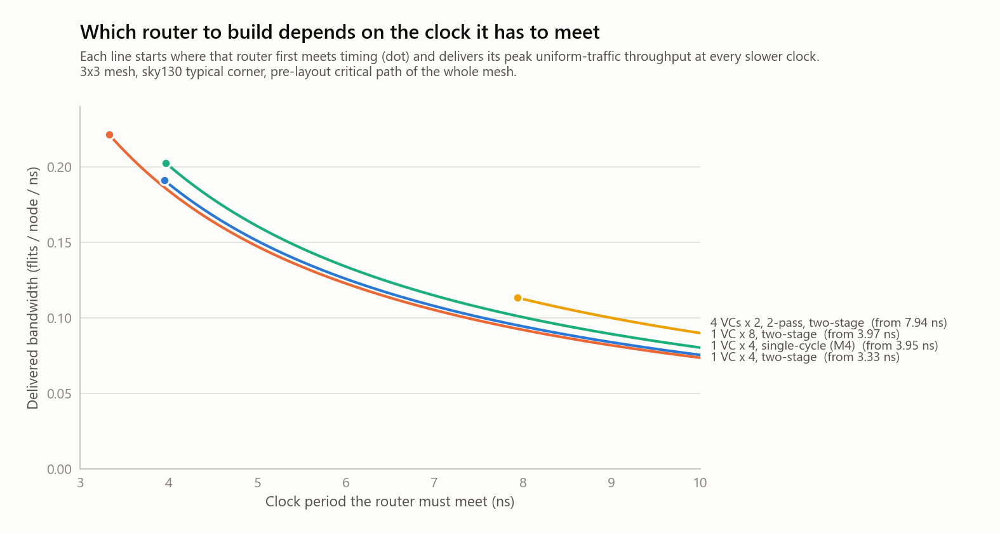

# M8 -- Pipelining, and Which Router to Build

M7 ended on an uncomfortable finding: per nanosecond, M5's
virtual-channel router delivered about half the bandwidth of M4's simple
one. VCs raise throughput per *cycle*, but the allocator stretches the
*cycle*. M8 asks the obvious next question: **does pipelining fix it?**

The answer is "partly", and finding out why led to a more useful result
than a yes would have been. A chip's clock is set by its cores and caches,
and the router has to meet it. So the real question is **which router
delivers the most bandwidth at the clock you have to meet.** M8 answers
that with measured data, for the whole mesh.

On the way, a measurement flaw in M7 turned up and got corrected.

## Results at a glance

- **A two-stage router** (`PIPE=1`): allocation in stage 1, the crossbar
  in stage 2. Throughput per cycle is unchanged within 3%. Zero-load
  latency goes from 3.0 to 6.0 cycles, exactly the predicted +1 cycle per
  router a flit passes through.
- **Pipelining helps the simple router most:** 3.95 -> **3.33 ns**
  (-16%). At **0.221 flits/node/ns**, it's the best design on this mesh
  whenever the clock is tight.
- **It helps the VC router least:** 8.66 -> 7.94 ns (-8%). The critical
  path now lives entirely in stage 1: credit check, two allocation passes,
  VC mux. The allocator itself is the limit; the crossbar never was.
  Beating that takes speculative, multi-cycle allocation, a much bigger
  project.
- **Decision rule, from the data:**
  - **Under ~4 ns** (> 250 MHz): build the simple single-queue router,
    pipelined, with buffers as deep as the area allows.
  - **At ~8 ns** (125 MHz) and slower: the 4-VC router with 2-pass
    allocation delivers ~12-22% more bandwidth than anything else that
    fits.
  - Virtual *networks* aren't part of this tradeoff. Coherence needs them
    for deadlock freedom (M5) at any clock; their cost is the 3-VN rows
    below.
- **Corrected M7:** timing is now measured on the **whole mesh**. M7's
  single-router numbers overstated its timing fixes about 2x (details
  below; [M7's README](../m7_synthesis/README.md) carries a correction
  note).
- **4×4 mesh:** latency matches the hop-count model on both sizes. VCs
  matter more on the larger mesh: +31% saturation throughput, vs +22% on
  3×3. VNs and the security layer behave the same as on 3×3
  ([details](#one-size-up-the-44-mesh)).
- **Verification of the two-stage router:** every suite passes,
  - 28/28 directed tests;
  - equivalence with `PIPE=0` (288 runs identical to M4/M5);
  - attack matrix both ways;
  - mutation tests both ways;
  - formal credit proofs including two-stage;
  - lint 0 warnings;
  - `run.sh` 15/15.

## The pipeline

```
 PIPE=0 (M4-M7): one cycle per hop
   FIFO head -> RC(at write) -> allocate -> VC mux -> crossbar -> link -> next router's FIFO
   |<--------------------------------- one clock --------------------------------->|

 PIPE=1: two stages per hop
   stage 1 (SA/VA):  FIFO head -> allocate -> VC mux -> [ register: flit, crossbar select, output VC ]
                     ...and, in the same cycle: pop the winning VC (credit back upstream),
                     charge the output VC's credit, advance the arbiters
   stage 2 (ST):     [ register ] -> crossbar -> link -> next router's FIFO
```

**Every state update happens in stage 1:** pops, credit charges, and
arbiter pointers. So each allocation sees exactly the state the previous
one left. There's no stale-request hazard and no replay logic, which is
why the change stays small and verifiable. The costs:

- **Latency:** one extra cycle per router a flit passes through. Uniform
  traffic averages 3 routers, so zero-load latency goes from 3.0 to 6.0
  cycles, measured exactly.
- **A longer credit loop:** a credit comes back 3 cycles after its flit
  was allocated, not 2. A single VC with 2-deep buffers can then use only
  2/3 of a link. Directed test T6 caught exactly this (see below).
- **The watchdog's discard flag travels with its flit.** The black-hole
  defense still identifies every discarded flit, in both modes.

`PIPE=0` builds M7's router unchanged. `tools/equivalence_check.sh`
confirms it reproduces M4's and M5's results digit for digit.

## Measuring timing on the whole mesh (and correcting M7)

M7 synthesized **one router** and called its longest path the critical
path. But a hop doesn't end at a router's output port. It ends in the
*next* router's input buffer, in the same clock cycle. Synthesized alone,
the router's ports are free endpoints, and that cross-link path is cut in
half.

M8's `tools/synth.sh` synthesizes the **flattened 3x3 mesh**, so the only
endpoints are the tiles' ports, and it reports where the critical path
starts and ends. The single-cycle routers' critical paths now visibly
cross a link: they start in one router (a FIFO head, or a credit
counter) and end in a neighbor's input logic.

| | One router (M7's method) | Whole mesh (M8) |
|---|---|---|
| 1 VC x 4: M6 RTL -> M7 RTL | 5.45 -> 3.62 ns (-34%) | 4.95 -> 4.13 ns (**-17%**) |
| 4 VCs x 2, 2-pass: M6 RTL -> M7 RTL | 10.56 -> 8.15 ns (-23%) | 10.10 -> 8.79 ns (**-13%**) |

The reason for most of the gap is **route-at-write**:
- For a single-cycle router it doesn't remove the route compare from the
  cycle. It moves the compare from the start of the path (this router
  reading its head) to the end (the next router writing the flit). The
  one-router measurement stopped before the end.
- In the two-stage router it does pay: the compare moves out of the
  allocation stage, which is now the bottleneck.

**All timing below is whole-mesh.** It's still a pre-layout estimate,
meaning sky130 typical corner, no wires, no clock-to-q or setup time.
It's sound for comparing designs, not a sign-off number.

## Results

Uniform random traffic, peak accepted throughput from the sweeps
(single-cycle: M5's `vc_sweep.csv`; two-stage: `results/sweep_pipe.csv`,
80 points, all correct). Critical paths are from `results/synth*.csv`.

| Router | Stages | Critical path | Peak (flits/node/cycle) | **Flits/node/ns** | Zero-load latency |
|---|---|---|---|---|---|
| 1 VC x 4 (M4) | 1 | 3.95 ns | 0.756 | 0.191 | 3.0 cycles |
| 1 VC x 4 | **2** | **3.33 ns** | 0.737 | **0.221** | 6.0 cycles |
| 1 VC x 8 | 1 | 5.06 ns | 0.811 | 0.160 | 3.0 |
| 1 VC x 8 | 2 | 3.97 ns | 0.804 | 0.203 | 6.0 |
| 4 VCs x 2, 1-pass | 1 | 6.16 ns | 0.824 | 0.134 | 3.0 |
| 4 VCs x 2, 1-pass | 2 | 5.35 ns | 0.820 | 0.153 | 6.0 |
| 4 VCs x 2, 2-pass (M5's best) | 1 | 8.66 ns | 0.905 | 0.105 | 3.0 |
| 4 VCs x 2, 2-pass | 2 | 7.94 ns | 0.901 | 0.113 | 6.0 |
| 3 VNs x 1 VC x 4, secure (the coherence router) | 1 | 5.85 ns | -- | -- | -- |
| 3 VNs x 1 VC x 4, secure | 2 | 5.32 ns | -- | -- | -- |

<picture>
  <source media="(prefers-color-scheme: dark)" srcset="results/clock_study_dark.png">
  
</picture>

## Which router to build

Read the chart at the clock you have to meet. The best design is the
highest line that exists there:

| Clock period to meet | Best design | Bandwidth | Why |
|---|---|---|---|
| 3.33-3.95 ns | 1 VC x 4, two-stage | 0.737/cycle | The only design that fits |
| 3.97-5.35 ns | 1 VC x 8, two-stage | 0.804/cycle | Deeper buffers beat VCs once they fit: +9% over 1 VC x 4 |
| 5.35-7.94 ns | 4 VCs x 2, 1-pass, two-stage | 0.820/cycle | +2% over 1 VC x 8: within noise. 1 VC x 8 single-cycle (0.811, fits from 5.06 ns) has half the latency, so it's the practical pick |
| >= 7.94 ns | 4 VCs x 2, 2-pass, two-stage | 0.901/cycle | Fits at last: +12% over 1 VC x 8, +22% over 1 VC x 4 |
| >= 8.66 ns | 4 VCs x 2, 2-pass, single-cycle | 0.905/cycle | Same bandwidth, half the hop latency |

When latency matters as much as bandwidth, the single-cycle variant of
whichever design fits is the better pick: half the zero-load latency, for
a few percent of bandwidth.

## What pipelining didn't fix, and why

For the VC routers, the critical path after pipelining starts at a
**credit counter** and ends at the **VC mux** feeding the stage
register:

```
credit_count -> has credit? -> eligible? -> input arbiter -> output arbiter
     -> [pass 2: input arbiter -> output arbiter] -> winning VC -> VC mux -> stage register
```

That's allocation itself, which a 2-stage split can't touch. The next
steps are known from the literature, and each is a project on its own:
- **Speculative switch allocation:** allocate the switch in parallel
  with VC allocation, and cancel on a conflict.
- **Allocation split across two cycles,** with nominations registered
  between the input and output stages. That needs replay when a
  registered nomination goes stale.
- **A wavefront allocator:** maximal matching in one pass, replacing the
  2-pass separable one.

The data says how much each would have to deliver. To beat the
two-stage 1 VC x 8 router's 0.203 flits/node/ns:
- 4 VCs x 2 with 2-pass allocation would need a clock period under
  ~4.4 ns (0.901 / 0.203).
- 4 VCs x 2 with 1 pass would need about 4.0 ns.

That's roughly half of today's numbers.

## Verification

The two-stage router got the same scrutiny as everything before it:

| Check | PIPE=0 | PIPE=1 |
|---|---|---|
| Directed tests (`vc_router_tb`, 28) | 28/28 | 28/28 |
| Equivalence with M4/M5, 288 runs | identical | (latency differs by design) |
| Throughput sweeps, uniform | (M5's 240 points) | 80 points, all correct |
| Attack matrix (`tools/attack_matrix.sh`) | identical to M6 | all attacks contained |
| Mutation test, 11 mutants x 6 runs | all caught | all caught |
| Formal: credit protocol C1-C4 | proved (bounded) | proved (bounded), 2 configs |
| Lint (`tools/lint.sh`) | 0 warnings | 0 warnings |
| `./run.sh` | 15/15 steps, both modes | |

One directed test had to change, and it's worth a sentence.
- **What happened:** T6 (fairness) required each of four inputs to win at
  least 9 grants in a fixed window. With two stages, the credit loop
  grows to 3 cycles, and a 2-deep downstream buffer accepts only 2 flits
  per 3 cycles. Total throughput dropped, and every input won 8 or 9.
- **The real property held:** fairness (shares within 1 of each other)
  was intact. The test was asserting an absolute count, a throughput
  number, when the property it names is fairness.
- **The fix:** it now checks what it claims, even shares and nobody
  starved.

## One size up: the 4×4 mesh

Every result up to here was measured on 3×3. The RTL has no 3×3
assumption: mesh size is a parameter and coordinates are 4 bits. The
testbenches now take `SWEEP_MESH_W/H` and `PROTO_MESH_W/H`; the default
stays 3. `tools/mesh_scaling.sh` (~6 min) reruns the key checks on 4×4,
all with two-stage routers.

**Throughput and latency against a first-principles model**
(`tools/mesh_scaling.py`). For uniform traffic with XY routing:
- zero-load latency = (average hops + 1) routers × 2 stages
- the saturation bound is set by the busiest channel's load

| Router | Mesh | Latency at 0.05 load (model) | Peak accepted | Bound | % of bound |
|---|---|---|---|---|---|
| 1 VC × 4 | 3×3 | 5.98 (6.00) | 0.737 | 1.000 | 74% |
| 1 VC × 4 | 4×4 | 7.46 (7.33) | 0.611 | 0.938 | 65% |
| 4 VCs × 2, 2-pass | 3×3 | 5.98 (6.00) | 0.901 | 1.000 | 90% |
| 4 VCs × 2, 2-pass | 4×4 | 7.46 (7.33) | 0.798 | 0.938 | 85% |

- **Latency** grows exactly as the hop count says. Every extra router
  costs two cycles and nothing else.
- **VCs matter more as the mesh grows.** On 4×4 the simple router reaches
  only 65% of the bound. Longer paths mean more flits wait behind a
  blocked head, and that is the head-of-line blocking VCs exist to remove.
  The VC router's advantage rises from +22% on 3×3 to **+31%** on 4×4.

**Protocol and security, all passing on 4×4:**
- One VN per class, hardened: 8 runs (4 seeds × 16 and 64 outstanding)
  completed every transaction, about 13–14k each, with no deadlock and no
  false alarm.
- One shared VN: deadlocks at cycle 543, with 252 transactions stuck.
- Black hole at interior tile 5:
  - unprotected, victims get 0.013 of the 0.187 they offer;
  - hardened, the tile is quarantined at cycle 306, all 5,970 measured
    victim packets arrive, and the network drains.

## Running it

```sh
./run.sh                          # lint + both modes: directed, protocol, attacks, sweep points (~3 min)
tools/mesh_scaling.sh             # the 4x4 study above (~6 min)
MESH=4x4 PIPE=1 tools/sweep.sh    # any sweep, at any mesh size
PIPE=1 tools/sweep.sh             # throughput sweeps, two-stage
tools/synth.sh                    # whole-mesh synthesis, single-cycle and two-stage (~4 min)
python tools/plot_clock.py        # the clock-target chart (needs matplotlib)
tools/formal.sh                   # includes the two-stage credit proofs
PIPE=1 tools/attack_matrix.sh     # M6's attacks against two-stage routers
PIPE=1 tools/mutation_test.sh     # 11 mutants, two-stage
tools/equivalence_check.sh        # PIPE=0 == M4/M5
```

## Not covered

- **Speculative or multi-cycle allocation:** the step that would let VC
  routers win at tight clocks (above).
- **Placement and routing:** real wires would lengthen the link paths.
  That favors pipelined designs, because their stage 2 has the slack.
- **Non-uniform traffic in the clock study.** The study uses uniform
  traffic, where VCs help most. For the topology-bound patterns, M4 and
  M5 showed no router change moves the limit.
